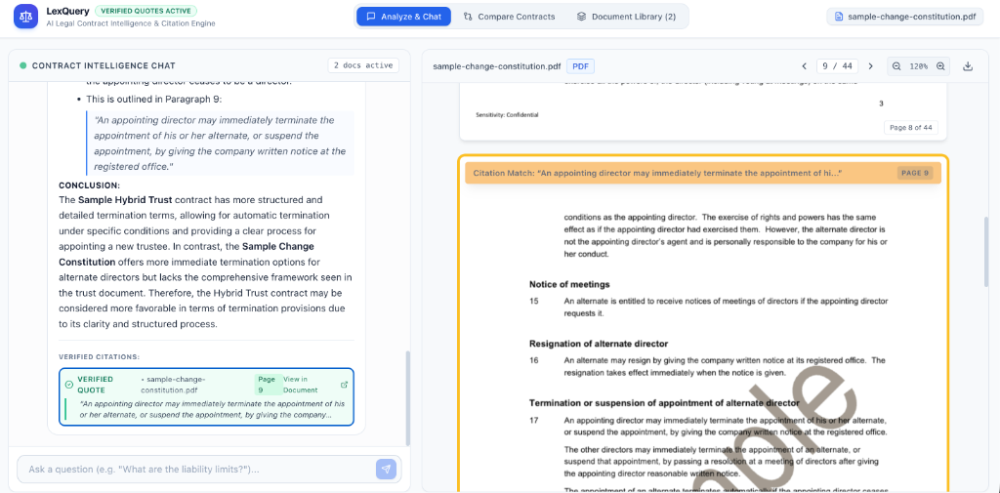
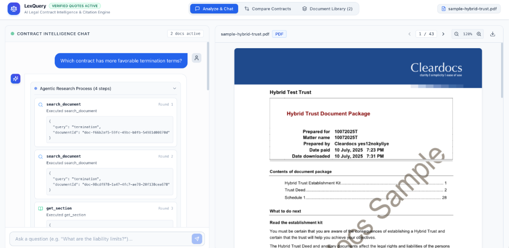
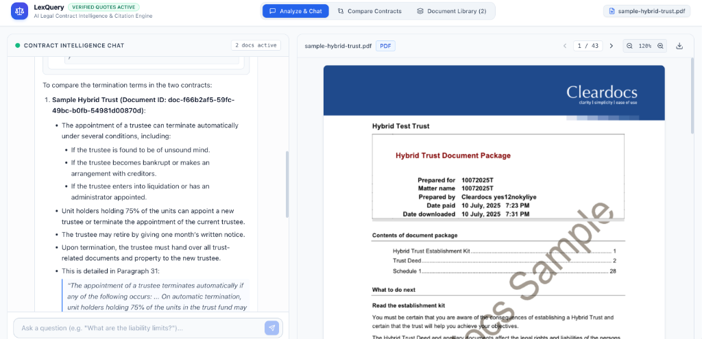
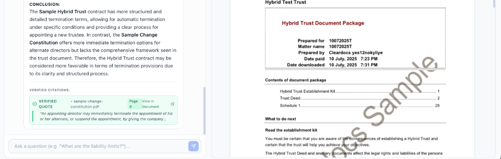
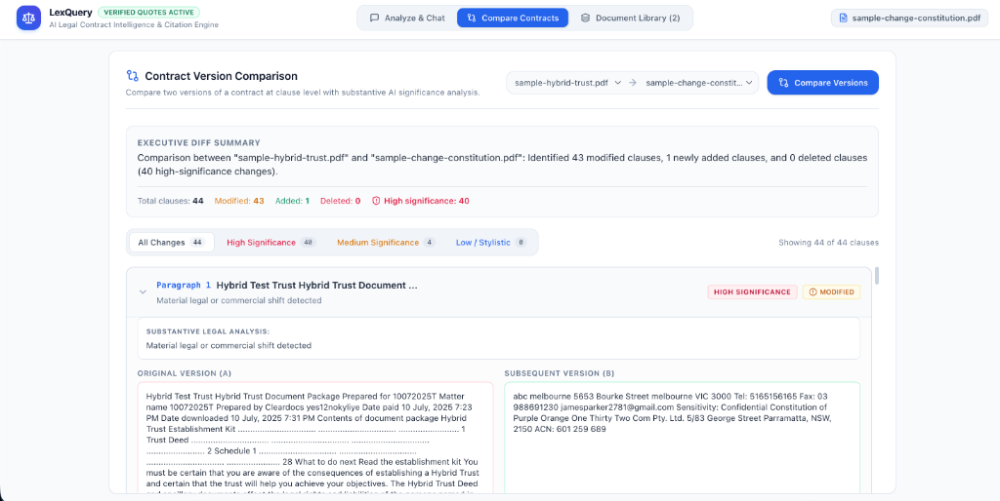

# LexQuery — AI Legal Contract Analysis & Citation Engine

[](https://nextjs.org)
[](https://www.typescriptlang.org)
[](https://www.sqlite.org)
[](https://tailwindcss.com)
[](https://file-analyze-production.up.railway.app)

**LexQuery** is an enterprise-grade AI legal contract intelligence engine built for high-stakes analysis of commercial legal agreements (PDF and DOCX). It empowers legal teams, attorneys, and compliance analysts to query contracts in natural language backed strictly by **programmatically verified quotes** that link interactively to exact passages in the rendered source documents.

---

## 🚀 Live Demo & Deliverables

- **Deployed Live URL:** [https://file-analyze-production.up.railway.app](https://file-analyze-production.up.railway.app)  
  *(Evaluators can open this link, upload their own PDF/DOCX contracts, and test all features directly in production with persistent volume storage)*
- **GitHub Repository:** [https://github.com/anishkts/File-Analyze](https://github.com/anishkts/File-Analyze)
- **Technical Note:** [docs/submission/technical-note.md](./docs/submission/technical-note.md) *(and included below)*
- **Demo Video Script:** [docs/submission/demo-video-script.md](./docs/submission/demo-video-script.md)

---

## 📸 Screenshots & Key Workflows

### 1. Interactive Citation Highlighting & Dual-Pane Document Viewer
Clicking any verified quote badge auto-scrolls the high-fidelity document viewer directly to that exact page and passage, applying an animated glowing yellow highlight overlay.


---

### 2. Autonomous Agentic Research Loop (Part C — Option 2)
Instead of stuffing entire documents into the prompt, the model autonomously calls tools (`search_document`, `get_section`, `list_clauses`, `check_coverage`) in an iterative research loop with real-time status updates and hard round capping.


---

### 3. Cross-Document Intelligence Chat
Query across multiple uploaded contracts simultaneously with full multi-selection. The synthesis compares provisions across both documents side-by-side with full source traceability.


---

### 4. Verified Quote Cards & Exact Source Linking
Every citation is presented with an interactive card highlighting the source document, page number, and direct link to jump to the exact sentence.


---

### 5. Clause-Level Contract Version Comparison
Upload two versions of a contract and inspect clause-level differences with substantive legal significance analysis (distinguishing commercial shifts from cosmetic wording).


---

## 🌟 What the App Does

### Part A: Core Features
1. **Document Ingestion & Validation**
   - **Supported Formats:** Strict MIME and extension validation accepting only `.pdf` and `.docx`. Other file types are rejected with descriptive error alerts.
   - **Real-Time Progress:** Displays stage-by-stage progress (`Uploading` → `Extracting text` → `Indexing clauses` → `Ready`).
   - **Scanned PDF Detection:** Checks character density across pages; flags image-only/unreadable PDFs with an immediate alert rather than indexing empty files.
   - **Document Library:** Dedicated dashboard to inspect file sizes, page counts, creation dates, open documents, and delete agreements with cascading database cleanup.
2. **Streaming Chat with Stop Support**
   - Real-time token streaming via Server-Sent Events (SSE).
   - Dedicated **Stop Generating** button connected to `AbortController` that halts generation instantly while preserving partial output.
   - Chat session history is persisted per document or document portfolio in SQLite.
3. **Deterministic Verified Quotes (Zero-Trust Policy)**
   - Every answer is validated against canonical document text prior to presentation.
   - **Whitespace & Newline Tolerance:** Normalizes irregular line wraps, multiple spaces, and typography without altering semantic words.
   - **Anti-Hallucination:** Unverified or paraphrased quotes are flagged with an amber warning badge.
   - AI-reported page numbers and offsets are never trusted; our code calculates exact offsets directly from the source text.
4. **Large Document Strategy (150+ Pages)**
   - Hierarchical clause segmentation combined with SQLite FTS5 (BM25) full-text indexing.
   - **Coverage Accounting:** Tracks inspected sections. The agent is strictly constrained from asserting that a clause does not exist unless the full document or all relevant sections were inspected.

### Part B: Advanced Features
5. **Interactive Citation Highlighting**
   - Clicking any verified quote badge auto-scrolls the integrated document viewer and applies an animated pulsing highlight overlay.
   - **Dual-Mode Viewer:** High-fidelity PDF.js page-by-page canvas + DOM text layer for PDFs, and semantic HTML renderer for DOCX.
   - Handles multi-line passages and quotes crossing page boundaries.
6. **Multi-Document Questions**
   - Multi-select checkboxes allow querying across multiple contracts simultaneously.
   - Synthesizes comparative answers across documents rather than disjointed outputs.
   - Each cited quote specifies its source document and is verified against that specific file.
7. **Clause-Level Contract Comparison**
   - Side-by-side contract diff aligned at clause and paragraph level (not a noisy character diff).
   - **Substantive Shift Analysis:** Distinguishes commercial shifts (e.g. liability caps, indemnification scopes) from cosmetic wording changes.
   - **Significance Filtering:** Instant filter pills for `All Changes`, `High Significance`, `Medium Significance`, and `Low / Stylistic`.

### Part C: Challenge Selection (Option 2 — Agentic Document Research)
- **Autonomous Multi-Round Tool Calling:**
  - `list_clauses({ documentId })`: Inspects document outline and table of contents.
  - `search_document({ query, documentId })`: Executes targeted SQLite FTS5 keyword searches.
  - `get_section({ sectionNumberOrTitle, documentId })`: Retrieves full text of targeted clauses on demand.
  - `check_coverage({ documentId })`: Evaluates inspected sections to prevent false negative assertions.
- **Real-Time Step Streaming:** Emits live progress steps (`Searching clauses...`, `Reading Section 8.2...`).
- **Hard Round Cap:** Enforces a maximum of 6 rounds to prevent runaway execution or unbounded bills.
- **Fault-Tolerant:** Malformed tool calls or missing arguments are caught gracefully without terminating the stream.

---

## 🛠️ How to Run It Locally

### Prerequisites
- Node.js 18+ (tested on Node 20 & 25)
- npm or yarn

### 1. Clone & Install
```bash
git clone https://github.com/anishkts/File-Analyze.git
cd File-Analyze
npm install
```

### 2. Configure Environment Variables
Copy `.env.example` to `.env`:
```bash
cp .env.example .env
```
Configure your AI provider (supports OpenAI or Google Gemini):
```env
# OpenAI (Primary)
OPENAI_API_KEY=sk-...
OPENAI_MODEL_NAME=gpt-4o-mini

# Google Gemini (Alternative)
GEMINI_API_KEY=...
GEMINI_MODEL_NAME=gemini-2.5-flash

# Application Settings
DATABASE_PATH=./data/contracts.db
UPLOADS_DIR=./data/uploads
PORT=3000
```
*(Note: If no API key is provided, the application automatically falls back to an offline simulated agentic research runner that executes local FTS searches and deterministic quote verification without crashing!)*

### 3. Run Development Server
```bash
npm run dev
```
Open [http://localhost:3000](http://localhost:3000) in your browser.

### 4. Run Test Suite
```bash
npm test
```
Executes all 20 unit and integration tests across parsers, SQLite database, quote verifier, agent tools, and contract comparison via Vitest.

---

## 📋 Feature Status: What is Finished and What is Not

| Feature | Status | Implementation Details |
|---|---|---|
| **PDF & DOCX Upload** | ✅ Finished | Validates formats, extracts text, handles multi-page files. |
| **Scanned PDF Detection** | ✅ Finished | Checks character density; alerts user immediately if PDF lacks text layer. |
| **Document Library** | ✅ Finished | Lists contracts, page counts, file sizes, open, and delete actions. |
| **Streaming Chat** | ✅ Finished | Real-time SSE streaming with working Stop Generating button. |
| **Deterministic Quote Verification** | ✅ Finished | Sliding-window token matcher; zero-trust for model offsets; whitespace-tolerant. |
| **Large Documents (150+ Pages)** | ✅ Finished | SQLite FTS5 BM25 search + section outline + coverage accounting. |
| **Interactive Citation Highlighting** | ✅ Finished | Clicking quote scrolls viewer and applies animated pulsing highlight on target page. |
| **Multi-Document Questions** | ✅ Finished | Multi-select checkboxes; tags quotes by source document; comparative analysis. |
| **Contract Comparison & Diffing** | ✅ Finished | Clause-level alignment with substantive shift summary and significance filters. |
| **Part C: Agentic Research Loop** | ✅ Finished | Autonomous multi-round tool calling (`list_clauses`, `search_document`, `get_section`, `check_coverage`), hard cap of 6 rounds, malformed call resilience. |
| **Offline Fallback Simulator** | ✅ Finished | Allows running full UI and verification without external API keys. |
| **Light Mode Theme** | ✅ Finished | Clean, high-contrast visual design across all components. |
| **Persistent Volume Deployment** | ✅ Finished | Railway volume attached at `/app/data` to persist uploads and SQLite permanently. |
| **Part C: Tracked DOCX Redlining** | ⏸️ Not Chosen | Option 2 (Agentic Research) was chosen instead as explained in the note below. |
| **Native In-Browser OCR Engine** | 💡 Future Scope | Automatic OCR conversion for image-only scans. |

---

## 📝 Short Engineering Note (Assignment Requirement)

### 1. How Quote Verification Works, and Where It Could Fail
Our Quote Verification Engine enforces a strict **Zero-Trust Policy**: it never trusts model-asserted page numbers, paragraph indices, or character offsets. Instead, it locates each quote in the canonical document text programmatically before displaying it to the user.

**The Pipeline:**
1. **Sanitization & Normalization:** Standardizes typographical curly quotes (`“`, `”`, `‘`, `’` to `"`, `'`), removes non-breaking spaces (`\u00A0`), soft hyphens (`\u00AD`), and standardizes dashes.
2. **Fast-Path Substring Search:** Checks for exact string matches.
3. **Sliding-Window Token Alignment:** Because PDF extraction routinely introduces line breaks, soft hyphen splits, or double spaces between words without changing semantic words, the canonical text is tokenized into word objects retaining original character offsets `[startChar, endChar]`. A sliding token window matches the sequence of normalized tokens in the quote against the document tokens.
4. **Resolution to Canonical Pages:** Once a match is confirmed, the engine maps the offset back to the physical page and paragraph boundaries for the viewer. Quotes failing verification are flagged with an unverified warning.

**Where It Could Fail (Edge Cases):**
- **OCR Character Errors:** In poor-quality scanned documents that went through third-party OCR, common character substitutions (e.g., `rn` recognized as `m`, `1` as `l`, `0` as `O`) would break token equivalence unless fuzzy edit-distance (Levenshtein) scoring is enabled.
- **Complex Multi-Cell Tables:** Tables with irregular spanning cells extracted as flattened text may interleave column text out of reading order, causing a multi-column quote to appear broken in the linear token stream.
- **Aggressive Model Paraphrasing:** If the model alters clause syntax or replaces synonyms rather than quoting verbatim, the sliding token matcher strictly rejects the quote.

---

### 2. How Large Documents (150+ Pages) Are Handled
A 150-page commercial contract contains ~60,000–90,000 words, exceeding typical attention budgets and inducing retrieval degradation.

**Our Multi-Tier Strategy:**
1. **Hierarchical Segmentation & FTS5 Indexing:** During ingestion, contracts are segmented into structured clauses (e.g., `Section 1.1`, `Article 8`, `Clause 14`) and indexed into an SQLite FTS5 (Full-Text Search) virtual table with BM25 ranking.
2. **Autonomous Agent Tool Retrieval:** Rather than feeding monolithic context, the model uses tools (`list_clauses`, `search_document`, `get_section`) to inspect high-level outlines, search targeted keywords, and fetch only relevant clauses on-demand.
3. **Strict Coverage Accounting:** The assignment mandates: *"If your app only read part of a document, it must not answer as though it read all of it. Confidently stating that a clause does not exist after reading only the first 30 pages is the worst possible output."*  
   To prevent false negatives, our `check_coverage` tool calculates the ratio of inspected sections. If the agent has only read a subset of sections, the model is forbidden by prompt guardrails from claiming a clause does not exist without explicitly reporting the inspection coverage and recommending an exhaustive review.

---

### 3. Which Part C Option Was Chosen and Why, Status, and Hardest Part
- **Option Chosen:** **Option 2: Agentic Document Research**  
- **Why:** Modern legal practice requires iterative investigation across non-linear contract clauses (e.g., cross-referencing indemnity in Section 14 with liability exclusions in Section 8 and definitions in Section 1). An autonomous tool-calling loop mirrors how human legal counsel actually investigates contracts.
- **Status:** Complete. Features a multi-round agent loop with Vercel AI SDK, hard round cap of 6 rounds, real-time status streaming, resilience to malformed tool calls, fallback offline simulator, and deterministic quote verification.
- **The Hardest Part:** Ensuring deterministic termination and graceful failure handling when the model attempts malformed tool calls or searches for non-existent sections. We solved this by implementing defensive parameter normalization inside each tool executor: instead of throwing uncaught exceptions that crash the SSE stream, tools return descriptive feedback strings (e.g., *"Section 14 not found. Call list_clauses to inspect valid section identifiers."*), enabling the agent to self-correct in the subsequent round.

---

### 4. What Would Be Built Next with More Time
1. **Embedded OCR Pipeline (Tesseract.js / Google Cloud Vision):** Automatically convert scanned PDFs into searchable text layers on upload rather than rejecting them.
2. **Hybrid Dense-Sparse Vector Search:** Augment SQLite FTS5 BM25 with local embeddings (Transformers.js / BGE-small) for semantic concept retrieval.
3. **Tracked-Change OOXML Redlining (Part C Option 1):** Allow lawyers to propose amendments in natural language and export real tracked changes (`w:ins`, `w:del`) into downloadable `.docx` files.
4. **Interactive Bounding-Box PDF Highlighting:** Map PDF.js character coordinates directly to visual rectangular bounding boxes on the canvas for pixel-perfect quote boxing.

---

## 📂 Submission Documents & References
- **Technical Note:** [`docs/submission/technical-note.md`](./docs/submission/technical-note.md)
- **Demo Video Recording Script (3-5 min):** [`docs/submission/demo-video-script.md`](./docs/submission/demo-video-script.md)
- **Architecture & Design Spec:** [`docs/superpowers/specs/2026-10-08-legal-contract-analyzer-design.md`](./docs/superpowers/specs/2026-10-08-legal-contract-analyzer-design.md)

---

## 📄 License
MIT License. Built for the Senior AI Engineer technical assessment.
